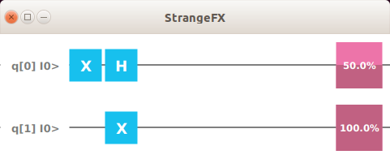

# strange
[](https://github.com/redfx-quantum/strange/actions/workflows/build.yml)
[](https://search.maven.org/#search|ga|1|org.redfx.strange)
[](https://opensource.org/licenses/GPL-3.0)
[](https://javadoc.io/doc/org.redfx/strange)

# Quantum Computing API and simulator for Java

This project defines a Java API that can be used to create Quantum Programs.
A Quantum Program, defined by <code>org.redfx.strange.Program</code> can be executed on an implementation of the 
<code>org.redfx.strange.QuantumExecutionEnvironment</code>.

You can read more about Java and QuantumComputing in [Quantum Computing in Action](https://www.manning.com/books/quantum-computing-in-action?a_aid=quantumjava&a_bid=e5166ab9)
<a href="https://www.manning.com/books/quantum-computing-for-java-developers?a_aid=quantumjava&a_bid=e5166ab9">
</a>

# Getting Started

Strange is distributed via Maven Central and can thus easily be used leveraging maven or gradle build software.

## Using JBang

JBang makes it easy to run simple Java applications without setup hassle.

You can download JBang from <a href="https://jbang.dev">jbang.dev</a>.

The following code is a very simple Java application that is using Strange (and StrangeFX). Save this code in a
file named ShortStrangeDemo.java and execute it by typing the following command in a terminal:
`jbang ShortStrangeDemo.java`

```
//DEPS org.redfx:strangefx:0.1.4
import org.redfx.strange.*;
import org.redfx.strange.gate.*;
import org.redfx.strange.local.SimpleQuantumExecutionEnvironment;
import org.redfx.strangefx.render.Renderer;
import java.util.Arrays;

public class ShortStrangeDemo {
    public static void main(String[] args) {
Program p = new Program(2, new Step(new X(0)), new Step(new Hadamard(0), new X(1)));
        SimpleQuantumExecutionEnvironment sqee = new SimpleQuantumExecutionEnvironment();
        Qubit[] qubits = sqee.runProgram(p).getQubits();
        Renderer.renderProgram(p);
        Arrays.asList(qubits).forEach(q -> System.out.println("qubit with probability on 1 = "+q.getProbability()+", measured it gives "+ q.measure()));
    }
}
```

The result of this is some output to the terminal, and a Window showing the Quantum Circuit you created:
```
qubit with probability on 1 = 0.4999999701976776, measured it gives 1
qubit with probability on 1 = 0.9999999403953552, measured it gives 1

```
(note that the first qubit can be measured as `0` or as `1`)


## Using maven

A typical `pom.xml` file looks as follows:

```maven
<project xmlns="http://maven.apache.org/POM/4.0.0" xmlns:xsi="http://www.w3.org/2001/XMLSchema-instance"
  xsi:schemaLocation="http://maven.apache.org/POM/4.0.0 http://maven.apache.org/maven-v4_0_0.xsd">
  <modelVersion>4.0.0</modelVersion>
  <groupId>org.redfx.javaqc</groupId>
  <artifactId>simplestrangedemo</artifactId>
  <packaging>jar</packaging>
  <version>1.0-SNAPSHOT</version>
  <name>SimpleStrangeDemo</name>
  <url>http://maven.apache.org</url>

  <dependencies>
    <dependency>
      <groupId>org.redfx</groupId>
      <artifactId>strange</artifactId>
      <version>0.1.1</version>
    </dependency>
  </dependencies>
  <build> 
    <plugins>
      <plugin>
        <groupId>org.openjfx</groupId>
        <artifactId>javafx-maven-plugin</artifactId>
        <version>0.0.6</version>
        <configuration>
          <mainClass>SimpleStrangeDemo</mainClass>
        </configuration>
      </plugin>
    </plugins>
  </build>
</project>

```

## Using gradle

A typical build.gradle file looks as follows:
```gradle
plugins {
    id 'application'
}

repositories {
    mavenCentral()
}

dependencies {
    implementation 'org.redfx:strange:0.1.1'
}

mainClassName = 'SimpleStrangeDemo'

```

# About the sample application.

The code pasted above in the `ShortStrangeDemo` snippet is a short version of the code
below. Both applications are similar, but the code below is more verbose which makes it
easier to explain what is going on.

```java
import org.redfx.strange.*;
import org.redfx.strange.gate.*;
import org.redfx.strange.local.SimpleQuantumExecutionEnvironment;
import java.util.Arrays;

public class SimpleStrangeDemo {

    public static void main(String[] args) {
        Program p = new Program(2);
        Gate xGate1 = new X(0); 
        Step step1 = new Step();
        step1.addGate(xGate1);
        p.addStep(step1);
        Gate hGate2 = new Hadamard(0);
        Gate xGate2 = new X(1);
        Step step2 = new Step();
        step2.addGates(hGate2, xGate2);
        p.addStep(step2);
        SimpleQuantumExecutionEnvironment sqee = new SimpleQuantumExecutionEnvironment();
        Result res = sqee.runProgram(p);
        Qubit[] qubits = res.getQubits();
        Arrays.asList(qubits).forEach(q -> System.out.println("qubit with probability on 1 = "+q.getProbability()+", measured it gives "+ q.measure()));
    }

}
```

This sample create a <code>Program</code> that requires 2 qubits. It will create 2 steps (<code>s</code> and <code>t</code>).
The first step adds a Paul-X (NOT) Gate to the first qubit. 
The second steps adds a Hadamard Gate to the first qubit, and a NOT gate to the second qubit.
Both steps are added to the <code>Program</code>.

In order to "run" this program, we need a <code>QuantumExecutionEnvironment</code>. Strange comes with a 
<code>SimpleQuantumExecutionEnvironment</code> which contains a very simple, non-optimized quantum computer simulator.

After running the program on this simulator, we inspect the state of the Qubits. As expected, there is a 50% chance the first qubit (which had an X and an H gate) will be in the <code>0</code> state, and a 50% chance it will be in the <code>1</code> state. The second qubit will always be in the <code>1</code> state.


Running this application a number of times will consistently give the same probabilities, and different measurements.

# Visualization

The Strange API's allow creating and simulate quantum programs. A companion project, [StrangeFX](https://github.com/redfx-quantum/strangefx) , allows visualising programs, and create them with a simple drag and drop interface. The sample program above rendered via StrangeFX looks as follows:


# More samples
You can find more samples at https://github.com/johanvos/quantumjava
